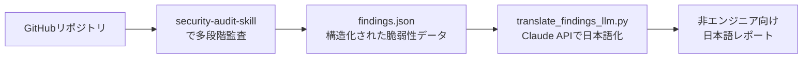

# vibe-audit-ja

バイブコーディング（Lovable / Claude Code / Bolt などで作ったアプリ）向けの、
**非エンジニアでも読めるセキュリティ監査レポート**を作るためのプロトタイプです。

## これは何？

[cloudflare/security-audit-skill](https://github.com/cloudflare/security-audit-skill) が出力する
技術者向けの `findings.json`（脆弱性の構造化データ）を受け取り、Claude API で
「専門用語なし・何が危なくて・何を頼めば直るか」が分かる自然な日本語レポートに変換します。

AI生成コードの62%が重大な脆弱性を含んで出荷される、という調査もある一方、
非エンジニアがそのレポートを読んでも「結局何をすればいいのか」が分からない、という
ギャップを埋めるための最初のステップです。

## 仕組み



1. `security-audit-skill` をコーディングエージェント（Claude Codeなど）にインストールし、対象リポジトリを監査 → `findings.json` を出力
2. `translate_findings_llm.py` が各 finding を Claude API に渡し、非エンジニア向けの説明文に書き直す
3. 重要度順に並べた Markdown レポートを出力

## セットアップ

```bash
pip install -r requirements.txt
export ANTHROPIC_API_KEY=sk-ant-xxxx
```

## 使い方

```bash
python3 translate_findings_llm.py demo/findings.json > demo/output/report_ja_llm.md
```

`ANTHROPIC_API_KEY` を設定していない場合は、`demo/findings.json` に含まれる2件の
サンプル脆弱性についてのみ、事前に用意した参考訳（`MOCK_TRANSLATIONS`）にフォールバックします。
それ以外のリポジトリを監査した場合は、キーを設定しないと翻訳できません。

## demo/ フォルダについて

`demo/app.js` は、動作確認のために **わざと** 2つの脆弱性を仕込んだサンプルアプリです（実際には動かさないでください）。

- SQLインジェクション（検索ワードを直接SQL文に埋め込んでいる）
- ハードコードされたAPIキーが公開エンドポイントから漏れている

`demo/findings.json` はこのアプリを `security-audit-skill` の公式スキーマ
（`report-schema.json`）に沿って手動で監査した結果で、公式バリデータ
（`validate-findings.cjs`）で検証済みです。

`demo/output/` に2種類のレポート例があります。

- `report_ja_template_only.md` — 見出しと重要度ラベルだけを日本語化した v1（本文は英語のまま）
- `report_ja_llm.md` — 本文までClaude APIで書き直した v2（本命）

## 現状の制約・次にやること

- [ ] 実際の `ANTHROPIC_API_KEY` で `report_ja_llm.md` を再生成し、本物のAPI応答で検証する
- [ ] `security-audit-skill` 本体をClaude Code経由で実リポジトリに対して実行し、`findings.json` を自動生成するパイプラインを組む
- [ ] Webフロント（GitHub連携・監査履歴・課金）を追加してSaaS化する
- [ ] `needs_validation` / `rejected` 判定の扱いをレポートに追加する

## クレジット・ライセンス

監査ロジックの土台は [cloudflare/security-audit-skill](https://github.com/cloudflare/security-audit-skill)
（MIT License）です。このリポジトリ自身のコード（`translate_findings_llm.py` 等）もMITライセンスとします。
`demo/app.js` は検証専用のサンプルで、本番環境にデプロイしないでください。
